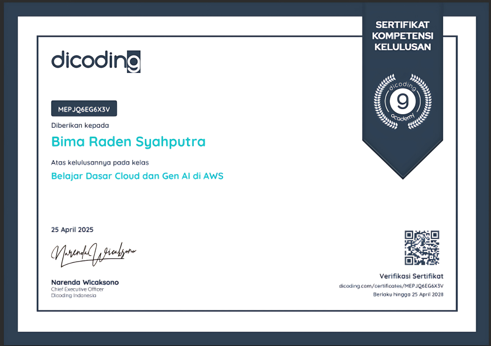

## 👋 Hai! Saya Bima Raden Syahputra

Saya seorang remaja dari Jakarta yang telah berkecimpung di dunia web development sejak tahun 2021.  
**"Web development is not just about building websites, it's about building experiences."**

---

### 🌐 Socials:
 

---

### 💻 Tech Stack:
            

---

## 📜 Sertifikasi

- **Belajar Dasar Cloud dan Gen Al di AWS** – AWS X Dicoding (2025)  
  

- **Belajar Dasar Pemrograman JavaScript** – AWS X Dicoding (2025)  
  

---

### 📊 GitHub Stats:
 
 

### 🔝 Top Contributed Repo

---

<!-- Proudly created with GPRM ( https://gprm.itsvg.in ) -->
